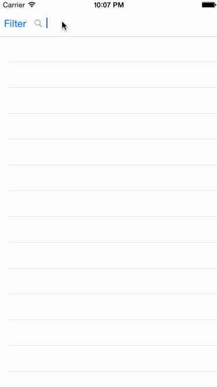

# Yelp iOS Application

This is an iOS iPhone application that allows searching for business using the [Yelp API](http://www.yelp.com/developers/documentation/v2/search_api).

Time spent: 18 hours spent in total

Completed user stories: 

Search Results Page

* [x] Required: Table rows should be dynamic height according to the content height.
* [x] Custom cells should have the proper Auto Layout constraints.
* [x] Search bar should be in the navigation bar (doesn't have to expand to show location like the real Yelp app does).

Filter Page

* [x] Required: The filters you should actually have are: category, sort (best match, distance, highest rated), radius (meters), deals (on/off).
* [x] Required: The filters table should be organized into sections.
* [x] Required: You can use the default UISwitch for on/off states.
* [x] Required: Radius filter should expand as in the real Yelp app.
* [x] Required: Categories should show a subset of the full list with a "See All" row to expand. Category list is here: http://www.yelp.com/developers/documentation/category_list (Links to an external site.)
* [x] Required: Clicking on the "Search" button should dismiss the filters page and trigger the search w/ the new filter settings.

Business Detail Page

* [x] Optional: Implement the restaurant detail page.

Notes:

The loading indicator will only display the first time that data is loaded since subsequent refreshes are invoked via the pull to refresh control, which has its own spinner.

Walkthrough of all user stories:

GIF created with [LiceCap](http://www.cockos.com/licecap/).
